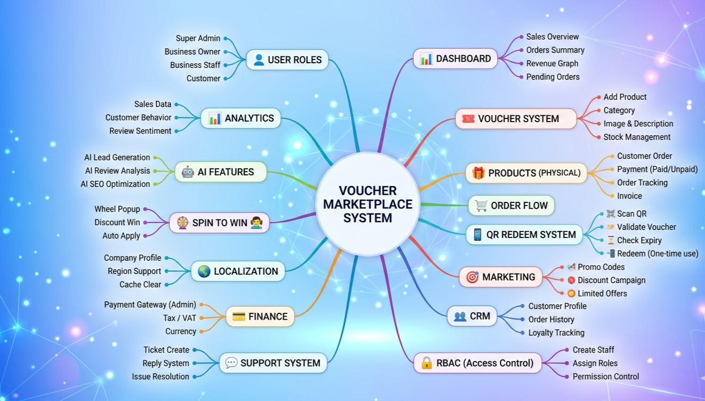

# Voucher-Marketplace-System-QA-Testing
A comprehensive SQA documentation project for a Voucher Marketplace System, featuring a detailed system mind map and an end-to-end testing checklist covering UI, Functional, Accessibility, and Performance testing

# 🎟️ Voucher Marketplace System - QA Documentation & Mind Map

This project represents a comprehensive architectural overview and a detailed QA testing strategy for a full-scale **Voucher Marketplace System**. 

## 🗺️ Project Mind Map

*The mind map outlines the core modules including User Roles, Voucher System, QR Redeem, AI Features, and more.*

## 📋 QA Testing Checklist
A robust testing strategy has been developed covering the following key areas:

### 📊 Dashboard Testing
1.  **UI Visual:** Ensuring consistent layout, alignment, and brand-matching elements.
2.  **Functional:** Validating sales overview data, order summaries, and real-time graph updates.
3.  **Responsive:** Ensuring the dashboard works seamlessly on Mobile, Tablet, and Desktop.
4.  **CrossBrowser:** Testing compatibility across Chrome, Firefox, Safari, and Edge.
5.  **Accessibility:** Verifying screen reader support and keyboard navigation (Tab-key validation).
6.  **Performance:** Analyzing page load time and API response stress under heavy data.

## 📝 Test Report Summary
Detailed bug reports and execution results are documented within the testing checklist to ensure high-quality software delivery.

## 🛠️ Tools Used
- **Mind Mapping:** [Whimsical](https://whimsical.com/)
- **Documentation:** MS Excel / Google Sheets
- **Version Control:** GitHub

## 🤝 Acknowledgement

